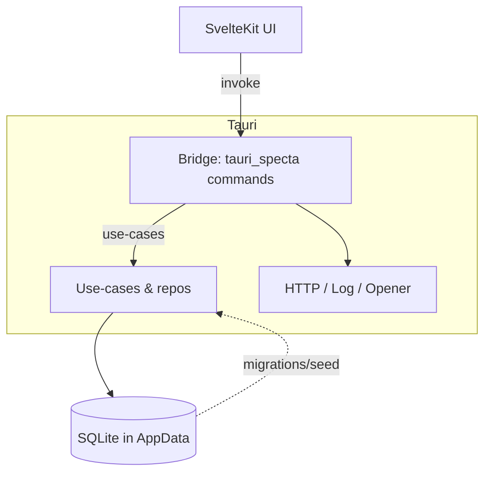

# Rusty Shed — Project Documentation

## Executive Summary
Rusty Shed is a Tauri 2 desktop application with a SvelteKit (Vite) frontend for managing model railway collections, wishlists, maintenance schedules, sellers, and catalog data. The Rust backend exposes IPC commands over the Tauri bridge and persists domain data in a SQLite database located in the app’s data directory. The UI redirects to the dashboard route at startup ([src/routes/+page.svelte](src/routes/+page.svelte#L1-L6)).

## Functional Requirements
Functional requirements are derived from the Tauri command surface exposed to the frontend (see registrations in [src-tauri/src/lib.rs](src-tauri/src/lib.rs#L29-L121)). Commands return domain DTOs or errors mapped to `CommandError` and often follow a Unit of Work + Use Case pattern.

- **App lifecycle**
  - `is_db_initialized` — query initialization flag ([src-tauri/src/lib.rs](src-tauri/src/lib.rs#L29-L34)).
  - `get_app_version` — return crate version string ([src-tauri/src/lib.rs](src-tauri/src/lib.rs#L36-L40)).
- **Catalog** ([src-tauri/src/catalog/interface/command_handlers.rs](src-tauri/src/catalog/interface/command_handlers.rs))
  - `get_manufacturer_by_id` — fetch manufacturer by ID; errors on invalid ID or DB failures.
  - `get_railway_company_by_id` — fetch railway company by ID.
  - `get_railway_model_by_id` — fetch single railway model (with rolling stocks if present).
  - `get_railway_models_by_ids` — batch fetch multiple models.
  - `create_railway_model` — validate and create a railway model and rolling stocks in a transaction.
- **Collecting / Depot** ([src-tauri/src/collecting/interface/command_handlers.rs](src-tauri/src/collecting/interface/command_handlers.rs))
  - `get_collection` — retrieve current collection snapshot from DB.
  - `get_depot` — alias of `get_collection`.
- **Dashboard** ([src-tauri/src/dashboard.rs](src-tauri/src/dashboard.rs))
  - `dashboard_summary` — aggregate counts (collection items, wishlists, maintenance due), latest items, and depot entries using collection, wishlist, and maintenance use-cases.
- **Collection (in-memory demo store)** ([src-tauri/src/collection.rs](src-tauri/src/collection.rs))
  - `list_collection_items` — list items with optional text search (in-memory store).
  - `create_collection_item` — add item to in-memory store.
  - `update_collection_item` — update item by ID in in-memory store.
  - `delete_collection_item` — remove item by ID in in-memory store.
- **Wishlists** ([src-tauri/src/wishlist/interface/command_handlers.rs](src-tauri/src/wishlist/interface/command_handlers.rs))
  - `get_wishlists` — list wishlist previews.
  - `get_wishlist_by_id` — fetch wishlist with items.
  - `create_wishlist` — create wishlist (optionally default) and return preview.
  - `rename_wishlist`, `delete_wishlist`, `set_default_wishlist` — manage wishlist metadata.
  - `add_to_wishlist` — add item with priority, status, desired price, notes, and added date (default now).
  - `remove_from_wishlist` — delete item by ID.
  - `move_item_to_list` — move item to another wishlist.
- **Maintenance** ([src-tauri/src/maintenance/interface/command_handlers.rs](src-tauri/src/maintenance/interface/command_handlers.rs))
  - `get_maintenance_dashboard` — list maintenance cards due/overdue.
  - `add_maintenance_record` — append maintenance record, parsing UUIDs and dates.
- **Sellers** ([src-tauri/src/sellers/interface/command_handlers.rs](src-tauri/src/sellers/interface/command_handlers.rs))
  - `get_sellers` — list sellers.
  - `get_seller_by_id` — fetch seller by ID.
  - `create_seller`, `update_seller`, `delete_seller` — CRUD operations with validation of seller IDs and types.

## System Architecture

- **Runtime**: Tauri 2 with Wry webview and SvelteKit frontend. SQLite database lives at `AppData/database.sqlite` resolved via Tauri path API ([src-tauri/src/lib.rs](src-tauri/src/lib.rs#L73-L96)). Migrations and seed data run asynchronously on startup, then the initialization flag is set ([src-tauri/src/lib.rs](src-tauri/src/lib.rs#L98-L117)).
- **Plugins in use** (configured in [src-tauri/src/lib.rs](src-tauri/src/lib.rs#L57-L71)):
  - `tauri-plugin-opener` — open external resources via the OS.
  - `tauri-plugin-http` — HTTP client capabilities (allowlisted to localhost; see capabilities section).
  - `tauri-plugin-log` — file/stdout logging with rotation (one file, 50 KB max) and level `Debug` in dev, `Info` otherwise.
- **Bridge Layer (IPC)**: Commands registered via `tauri_specta::collect_commands!` and exposed to JS through `invoke`. TypeScript bindings are emitted during dev to `src/lib/bindings.ts` ([src-tauri/src/lib.rs](src-tauri/src/lib.rs#L42-L55)).
- **State Management**: `AppState` wraps an atomic `initialized` flag and a shared `SqlitePool` managed by Tauri ([src-tauri/src/state.rs](src-tauri/src/state.rs#L1-L58)).
- **Domain Modules**: Catalog, collecting, collection (in-memory), wishlist, maintenance, sellers; each exposes command handlers that orchestrate use-cases and repositories.

## Security & Permissions

- **Capability definition**: Single capability `default` applies to the `main` window ([src-tauri/capabilities/default.json](src-tauri/capabilities/default.json)). Granted permissions:
  - `core:default` and `core:webview:allow-internal-toggle-devtools` — baseline Tauri operations plus webview devtools toggle.
  - `log:default` — allow log plugin access.
  - `http:default` and `http:allow-fetch` restricted to `http://localhost:*` — HTTP plugin limited to localhost traffic.
- **Content Security Policy**: `default-src 'self';` with explicit allowances for inline styles, Google Fonts, localhost connect-src, and data/asset image schemes ([src-tauri/tauri.conf.json](src-tauri/tauri.conf.json#L16-L21)).
- **Windows**: Single window `main` (1024x768, visible on launch) ([src-tauri/tauri.conf.json](src-tauri/tauri.conf.json#L8-L15)).

## Data Flow

- **IPC pattern**: Frontend calls Rust commands via `invoke`; there is no event emission observed in the backend. Commands typically:
  1. Clone the shared SQLite pool from `AppState`.
  2. Start a Unit of Work (`SqliteUnitOfWork`) when persistence is needed.
  3. Execute a use-case; on success commit; on failure map to `CommandError`.
  4. Return DTOs serialized for the frontend.
- **Bindings**: `tauri_specta` + `specta_typescript` generate type-safe TS bindings during debug builds to keep frontend types aligned with Rust models.
- **Frontend navigation**: root path redirects to `/my-dashboard`; additional routes under `my-collection`, `my-wishlists`, `my-depot`, etc., consume the above commands for data (based on directory structure under `src/routes/`).

## Technical Debt / Gaps

- **In-memory collection commands**: `list_collection_items`, `create_collection_item`, `update_collection_item`, and `delete_collection_item` operate on a process-local mutex store without persistence ([src-tauri/src/collection.rs](src-tauri/src/collection.rs)). Data resets each run; consider backing these operations with SQLite for consistency with other modules.
- **Capability surface**: Only the default capability is defined. If additional windows or richer permissions are needed (filesystem, shell, broader HTTP), new capability files must be added and referenced in `tauri.conf.json`.
- **Error handling consistency**: Some commands map errors to `CommandError::Unknown` with string messages; others return validation-specific errors. Aligning error taxonomy would improve frontend handling.
- **HTTP plugin scope**: HTTP access is limited to localhost; if remote APIs are required, capability updates are needed alongside CSP/connect-src adjustments.
- **Startup sequencing**: Migrations and seed run asynchronously after window show. UI must handle the period before `initialized` is true; ensure frontend guards are present on all routes.
