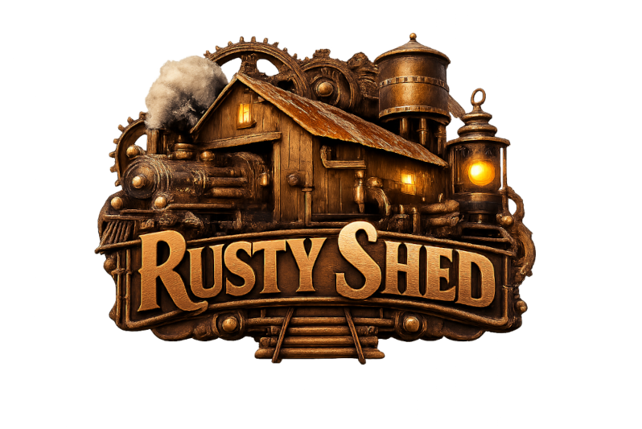

# Rusty Shed — Model Railway Collection Manager

[](https://opensource.org/licenses/Apache-2.0)

[](https://github.com/CarloMicieli/rusty-shed/actions/workflows/ci.yml)



Rusty Shed helps model railway enthusiasts manage their collections, their wish lists, their railway model maintenance with a native desktop UI powered by Tauri (Rust) and a SvelteKit frontend.

## Quick Overview

- Frontend: SvelteKit (Vite)
- Backend: Tauri (Rust) — IPC via `invoke` between frontend and Rust

## Running on Ubuntu (prerequisites)

You need Bun, the Rust toolchain (`rustup`, `cargo`) and the Tauri CLI if you prefer to use it. On Ubuntu, this project required a few additional system packages to compile GTK / webview dependencies — install these before building:

```bash
sudo apt update
sudo apt install -y \
	libsoup-3.0-dev \
	libjavascriptcoregtk-4.1-dev \
	libgtk-3-dev \
	libwebkit2gtk-4.1-dev \
	librsvg2-dev
```

## Development

1. Install JS and Rust deps:

```bash
bun install
rustup toolchain install stable
```

2. Start the frontend dev server:

```bash
bun run dev
```

3. In a separate terminal run Tauri (launches the desktop app using the Vite dev server):

```bash
bun run tauri dev
```

## Build (production)

```bash
bun run build
bun run tauri build
```

## Committing

This repository follows Conventional Commits. Use the provided Commitizen config to compose messages that follow the project's commit rules:

```bash
bun install
bun run commit
```

This will launch the interactive Commitizen prompt which enforces the allowed commit prefixes (eg. `feat`, `fix`, `docs`, `chore`, etc.).

## Rust Commands

You can run common Cargo commands for the Tauri/Rust crate located in `src-tauri` using the `bun` scripts added to `package.json`.

Examples:

```bash
bun run rust:fmt     # runs `cargo fmt --manifest-path src-tauri/Cargo.toml`
bun run rust:build   # runs `cargo build --manifest-path src-tauri/Cargo.toml`
bun run rust:run     # runs `cargo run --manifest-path src-tauri/Cargo.toml`
bun run rust:test    # runs `cargo test --manifest-path src-tauri/Cargo.toml`
bun run rust:clean   # runs `cargo clean --manifest-path src-tauri/Cargo.toml`
bun run rust:clippy  # runs `cargo clippy --manifest-path src-tauri/Cargo.toml`
```

Pass extra Cargo flags after `--`, for example:

```bash
bun run rust:build -- --release
bun run rust:run -- --bin <binary-name>
```

These commands let you invoke Cargo for the `src-tauri` crate without changing directories.
