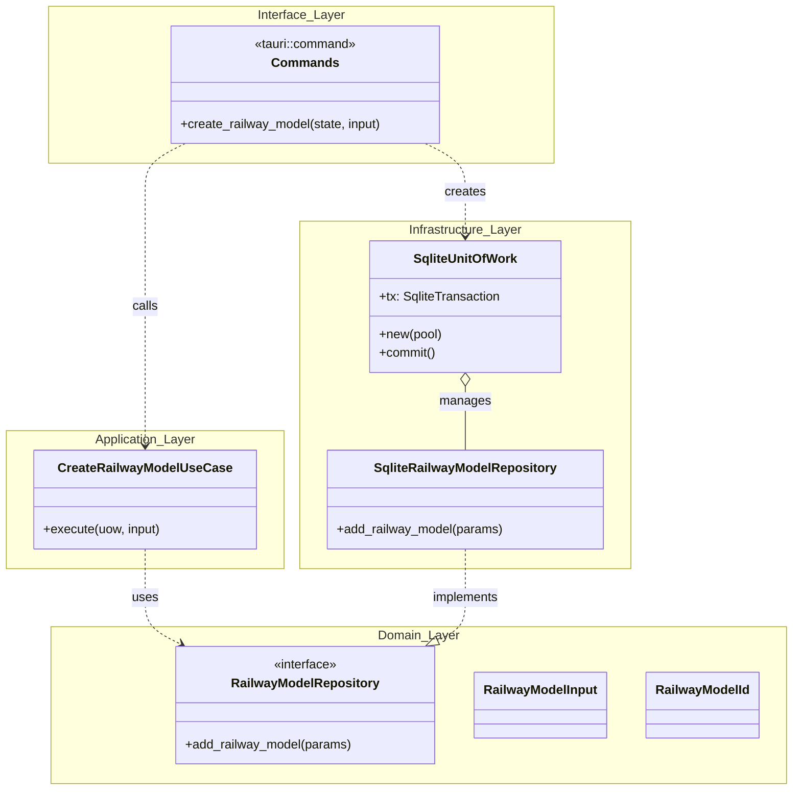

# Technical Architecture Document: Feature Implementation

## 1. Architectural Overview

The system is divided into four distinct layers within the feature module, ensuring that the domain logic remains isolated from the Tauri framework and the SQLite database.

### Core Components

- **Domain Layer:** The "heart" of the software. Contains entities, value objects, and repository interfaces (traits). It has no dependencies on other layers.
- **Application Layer:** Orchestrates the flow of data. Contains **Use Cases** that implement specific business rules by interacting with Domain abstractions.
- **Infrastructure Layer:** Provides concrete implementations for Domain traits (e.g., `SqliteRailwayModelRepository`). It handles the technical details of persistence and external APIs.
- **Interface Layer:** The entry point for the frontend. In Tauri, this consists of `#[tauri::command]` functions that translate IPC calls into Application Use Case invocations.

---

## 2. Design Patterns

### Unit of Work (UoW)

Located in the `core` module, the `SqliteUnitOfWork` manages the lifecycle of a database transaction.

- **Purpose:** Ensures atomicity. All repository operations performed within a Use Case either succeed together or fail together.
- **Lifecycle:** Created in the Interface layer, passed as a mutable reference to the Application layer, and finally committed in the Interface layer if successful.

### Repository Pattern

The `RailwayModelRepository` trait abstracts the database. This allows the Application layer to save/load data without knowing the underlying storage is SQLite.

### Extension: Repository Factory (RailwayModelUowExt)

The `RailwayModelUowExt` trait extends the `SqliteUnitOfWork` to act as a factory for domain repositories. This pattern further decouples the **Application** layer from the **Infrastructure** layer.

#### Key Features

- **Dependency Inversion:** Use Cases interact with the `RailwayModelRepository` trait rather than the concrete `SqliteRailwayModelRepository`.
- **Transaction Safety:** By re-borrowing the internal transaction (`&mut *self.tx`), the repository is cryptographically bound to the lifecycle of the Unit of Work. This ensures all operations are executed within the same atomic boundary.
- **Memory Safety:** The use of lifetime elision (`'_`) ensures that the repository cannot outlive the transaction, preventing "use-after-rollback" errors at compile time.

#### Usage Example

```rust
pub async fn execute(uow: &mut SqliteUnitOfWork<'_>) -> Result<(), DomainError> {
    // Access the repository via the extension trait
    let mut repo = uow.railway_model_repository();
    repo.add_item(params).await?;
    Ok(())
}

```

---

## 3. Data Flow Execution

The following sequence describes the lifecycle of a single request, such as creating a new railway model:

1. **Frontend Call:** The TypeScript frontend invokes the `create_railway_model` command.
2. **Interface Entry:** The Tauri command receives the `AppState` and input data. It initializes the `SqliteUnitOfWork` (starting a transaction).
3. **Application Dispatch:** The command calls `CreateRailwayModelUseCase::execute(&mut unit_of_work, data)`.
4. **Domain Interaction:** The Use Case uses the repository (accessible via the UoW) to perform domain logic and persistence staging.
5. **Finalization:** \* If successful: The Interface layer calls `unit_of_work.commit()`, finalizing the transaction.

- If an error occurs: The UoW is dropped, triggering an automatic rollback, and a `CommandError` is returned to the frontend.

---

## 4. Module Structure Reference

| Module               | Responsibility               | Key Structs/Traits                             |
| -------------------- | ---------------------------- | ---------------------------------------------- |
| **`domain`**         | Business logic & Definitions | `RailwayModelParams`, `RailwayModelRepository` |
| **`application`**    | Orchestration                | `CreateRailwayModelUseCase`                    |
| **`infrastructure`** | Implementation               | `SqliteRailwayModelRepository`                 |
| **`interface`**      | Tauri Bridge                 | `create_railway_model` (Command)               |
| **`core`**           | Shared Utilities             | `SqliteUnitOfWork`                             |

---

## 5. Error Handling Strategy

- **`DomainError`:** Errors related to business rules (e.g., "Model name already exists").
- **`CommandError`:** A serializable error type returned to the frontend. It maps `DomainError` and database errors into a format the TypeScript side can understand.

> **Note:** We use `specta` on the commands to automatically generate TypeScript types, ensuring type safety across the Rust-Frontend boundary.

## 6. Diagrams


