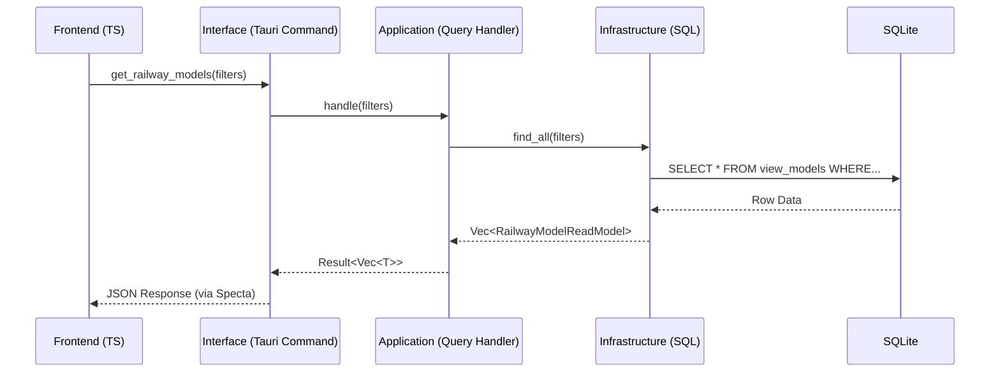

# Technical Architecture Document: Query System

## 1. Architectural Overview

The Query System is designed to provide a fast, read-only path for fetching data to the frontend. While features (commands) focus on state changes, queries focus on efficient data projection and retrieval.

### Core Components

- **Domain Layer (Read Models):** Contains DTOs (Data Transfer Objects) and specialized Query Repository interfaces. These represent the data as the UI needs to see it, rather than how it is stored.
- **Application Layer (Query Handlers):** Orchestrates the retrieval process. These handlers apply necessary filters, sorting, or pagination logic.
- **Infrastructure Layer:** Implements the Query Repository interfaces using optimized SQL queries (often involving JOINs or views) that bypass complex domain entity reconstruction.
- **Interface Layer:** Tauri commands that serve as the entry point for the frontend to request data.

---

## 2. Design Patterns

### The Read-Only Repository

Unlike Feature Repositories that handle domain entities, **Query Repositories** return simple, serializable structs. This allows the system to remain "Thin" on the read side, avoiding the overhead of business logic validation when simply displaying a list.

### Query Object Pattern

Complex filters (e.g., search strings, date ranges, tags) are encapsulated into **Query Objects**. This prevents method signature bloat in the repository traits.

### Result Pagination & Projection

- **Projection:** Only the fields required by the UI are fetched from the database.
- **Pagination:** Uses a standardized `PaginatedResult<T>` wrapper to provide the frontend with total counts and current page offsets.

### Unit of Work pattern

While queries are read-only, using the Unit of Work (UoW) pattern for them ensures consistency. It allows to run multiple queries against the exact same database snapshot and makes your Application Layer API uniform across both Commands and Queries.

#### Why use UoW for Queries?

- **Snapshot Isolation**: If you run two different queries within the same execute method, you are guaranteed that the data didn't change between the first and second query.
- **Developer Experience**: Developers don't have to remember two different patterns. Whether they are writing a "Create" feature or a "List" feature, the entry point is always execute(&mut uow, ...).
- **Easy Mocking**: You can mock the entire UoW in your Application Layer tests to return specific query results without touching a real SQLite database.

---

## 3. Data Flow Execution

The lifecycle of a query follows a streamlined path from the UI to the database:

1. **Frontend Request:** The TypeScript UI calls a query command (e.g., `get_railway_models`).
2. **Interface Entry:** The Tauri command extracts parameters (filters, pagination) and acquires a read-only database connection from the `AppState`.
3. **Application Dispatch:** The command invokes a **Query Handler**. Unlike Features, Queries often do not require a full `Unit of Work` because they do not modify state and don't require transaction atomicity.
4. **Infrastructure Execution:** The concrete implementation executes a `SELECT` statement, mapping the rows directly into Read Model DTOs.
5. **Response:** The Interface layer returns the DTOs to the frontend, serialized via `serde`.

---

## 4. Module Structure Reference

| Module               | Responsibility    | Key Structs/Traits                     |
| -------------------- | ----------------- | -------------------------------------- |
| **`domain`**         | Data Projections  | `RailwayModelReadModel`, `ModelFilter` |
| **`application`**    | Query Logic       | `GetRailwayModelsHandler`              |
| **`infrastructure`** | Optimized SQL     | `SqliteRailwayModelQueryRepository`    |
| **`interface`**      | Tauri Read Bridge | `get_railway_models` (Command)         |
| **`core`**           | Shared Read Utils | `PaginationParams`, `SortDirection`    |

---

## 5. Performance & Type Safety

### Database Views

For complex queries involving multiple joins, we utilize **Database Views** within the Infrastructure layer. This keeps the Rust SQL code clean and leverages the SQLite query optimizer.

### Cross-Boundary Type Safety

Just as with commands, we use `specta` to export our Read Model types. This ensures that when a database column is renamed or a field is added, the TypeScript compiler will immediately flag errors in the UI components.

---

## 6. Diagrams



## 7. Example Query Command

### **The Read Model (Domain Layer)**

```rust
#[derive(serde::Serialize, specta::Type)]
pub struct RailwayModel {
    pub id: String,
    pub name: String,
    pub scale: String,
    pub last_maintained: String,
}
```

### **The Repository Trait (Domain Layer)**

We define a read-only repository trait.

```rust
#[async_trait::async_trait]
pub trait RailwayModelQueryRepository {
    async fn list_all(&mut self) -> Result<Vec<RailwayModel>, DomainError>;
    async fn get_summary(&mut self, id: &str) -> Result<RailwayModel, DomainError>;
}
```

### **The Query Handler (Application Layer)**

The handler accepts the SqliteUnitOfWork. It uses the extension trait to get the query repository and fetch the data.

```rust
pub struct GetRailwayModelsQuery;

impl GetRailwayModelsQuery {
    pub async fn execute(
        uow: &mut SqliteUnitOfWork<'_>
    ) -> Result<Vec<RailwayModel>, DomainError> {
        // Access the query repository via the UoW extension
        let mut repo = uow.railway_model_query_repository();

        let items = repo.list_all().await?;

        // You can perform additional orchestration here,
        // like combining data from multiple query repositories

        Ok(items)
    }
}
```

### **The UoW Extension (Infrastructure Layer)**

We extend your existing SqliteUnitOfWork to provide the RailwayModelQueryRepository.

```rust
pub trait RailwayModelQueryExt {
    fn railway_model_query_repository(&mut self) -> SqliteRailwayModelQueryRepository<'_>;
}

impl<'a> RailwayModelQueryExt for SqliteUnitOfWork<'a> {
    fn railway_model_query_repository(&mut self) -> SqliteRailwayModelQueryRepository<'_> {
        // Re-borrows the existing transaction/connection for the query
        SqliteRailwayModelQueryRepository::new(&mut *self.tx)
    }
}
```

### **The Tauri Command (Interface Layer)**

This is where the UoW is instantiated and the query is dispatched.

```rust
#[tauri::command]
#[specta::specta]
pub async fn get_railway_models(
    state: tauri::State<'_, AppState>
) -> Result<Vec<RailwayModelListItem>, CommandError> {
    // 1. Initialize UoW (Starts a read-only transaction)
    let mut uow = SqliteUnitOfWork::new(&state.db_pool).await?;

    // 2. Execute the Query
    let result = GetRailwayModelsQuery::execute(&mut uow).await?;

    // 3. Optional: Commit is usually a no-op for reads,
    // but ensures the transaction closes cleanly.
    uow.commit().await?;

    Ok(result)
}
```
