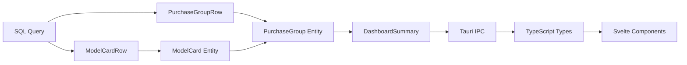

# Data Model: Dashboard Collector's Overview Redesign

**Feature**: 017-dashboard-redesign  
**Date**: February 9, 2026  
**Purpose**: Define domain entities and view models for purchase-grouped dashboard

## Domain Entities (Backend - Rust)

### 1. PurchaseGroup

Represents a collection of models acquired in a single purchase event.

```rust
/// A group of models acquired together (same purchase date + seller)
#[derive(Debug, Clone, Serialize, specta::Type)]
#[serde(rename_all = "camelCase")]
pub struct PurchaseGroup {
    /// Unique identifier for display purposes (format: "purchase-YYYY-MM-DD-{seller_id}")
    pub id: String,

    /// Date when the models were purchased (ISO 8601 date string)
    pub purchase_date: String,

    /// Name of the seller/shop (optional)
    pub seller_name: Option<String>,

    /// User notes about this purchase transaction
    pub notes: Option<String>,

    /// List of model cards in this purchase (max 3 for display)
    pub model_cards: Vec<ModelCard>,

    /// Total number of models in this purchase (for "+N more" indicator)
    pub total_count: usize,
}
```

**Validation Rules:**

- `purchase_date`: Must be valid ISO 8601 date (YYYY-MM-DD)
- `model_cards`: Must contain 1-3 items for display (even if total_count > 3)
- `total_count`: Must be >= model_cards.len()
- `id`: Generated from purchase_date + seller_id for stable sorting

**Relationships:**

- Contains 1..N ModelCard entities
- References Seller indirectly via seller_name (denormalized for display)

---

### 2. ModelCard

Visual summary of a single railway model for card display.

```rust
/// Compact view of a railway model for dashboard card display
#[derive(Debug, Clone, Serialize, specta::Type)]
#[serde(rename_all = "camelCase")]
pub struct ModelCard {
    /// Unique model identifier (format: "trn:railway-model:{manufacturer}:{product_code}")
    pub id: RailwayModelId,

    /// Path to thumbnail image (relative to data directory)
    pub thumbnail_path: Option<String>,

    /// Manufacturer name (e.g., "Roco", "Fleischmann")
    pub manufacturer: String,

    /// Product code from manufacturer
    pub product_code: String,

    /// Purchase condition status
    pub condition: PurchaseCondition,

    /// Model description or auto-generated title
    /// Frontend will truncate to ~50 characters
    pub description: String,
}
```

**Validation Rules:**

- `id`: Must be valid RailwayModelId format
- `manufacturer`: Non-empty string
- `product_code`: Non-empty string
- `description`: Non-empty string (min 3 chars, max 255 chars before truncation)

**Relationships:**

- Belongs to exactly one PurchaseGroup
- Links to RailwayModel entity (via id)
- Links to Manufacturer entity (via manufacturer name, denormalized)

---

### 3. PurchaseCondition (Enum)

```rust
/// Condition status of a model at time of purchase
#[derive(Debug, Clone, Copy, PartialEq, Eq, Serialize, Deserialize, specta::Type)]
#[serde(rename_all = "SCREAMING_SNAKE_CASE")]
pub enum PurchaseCondition {
    /// Brand new, unopened
    New,

    /// Previously owned, used
    PreOwned,

    /// Condition not specified
    Unknown,
}

impl Default for PurchaseCondition {
    fn default() -> Self {
        Self::Unknown
    }
}

impl From<Option<String>> for PurchaseCondition {
    fn from(value: Option<String>) -> Self {
        match value.as_deref() {
            Some("NEW") => Self::New,
            Some("PRE_OWNED") => Self::PreOwned,
            _ => Self::Unknown,
        }
    }
}
```

---

### 4. DashboardSummary (Extended)

Existing entity extended with purchase groups.

```rust
/// Comprehensive dashboard summary (EXTENDED)
#[derive(Debug, Clone, Serialize, specta::Type)]
#[serde(rename_all = "camelCase")]
pub struct DashboardSummary {
    /// Aggregated totals (existing)
    pub totals: DashboardTotals,

    /// NEW: Recent purchase groups (replaces or supplements recentItems)
    pub purchase_groups: Vec<PurchaseGroup>,

    /// Depot items (existing, unchanged)
    pub depot_items: Vec<DashboardDepotEntry>,

    /// DEPRECATED: Legacy recent items (may be removed in future version)
    #[deprecated(note = "Use purchase_groups instead")]
    pub recent_items: Vec<DashboardRecentItem>,
}
```

**Migration Strategy:**

- Keep `recent_items` for backward compatibility during transition
- Frontend switches to `purchase_groups` rendering
- Remove `recent_items` in next major version

---

## View Models (Frontend - TypeScript)

These types are auto-generated from Rust via `specta` but documented here for reference.

### 1. PurchaseGroup (TypeScript)

```typescript
/**
 * A group of models acquired together (same purchase date + seller)
 * Generated from Rust via specta
 */
export interface PurchaseGroup {
  /** Unique identifier for display purposes */
  id: string;

  /** Date when the models were purchased (ISO 8601 date string) */
  purchaseDate: string;

  /** Name of the seller/shop (optional) */
  sellerName: string | null;

  /** User notes about this purchase transaction */
  notes: string | null;

  /** List of model cards in this purchase (max 3 for display) */
  modelCards: ModelCard[];

  /** Total number of models in this purchase */
  totalCount: number;
}
```

**UI-Specific Computed Properties:**

```typescript
// Derived in component
const hasMoreItems = $derived(purchaseGroup.totalCount > 3);
const moreItemsCount = $derived(purchaseGroup.totalCount - 3);
const formattedDate = $derived(formatDate(purchaseGroup.purchaseDate));
const sellerDisplay = $derived(purchaseGroup.sellerName ?? m.dashboard_seller_unknown());
```

---

### 2. ModelCard (TypeScript)

```typescript
/**
 * Compact view of a railway model for dashboard card display
 * Generated from Rust via specta
 */
export interface ModelCard {
  /** Unique model identifier */
  id: RailwayModelId;

  /** Path to thumbnail image */
  thumbnailPath: string | null;

  /** Manufacturer name */
  manufacturer: string;

  /** Product code from manufacturer */
  productCode: string;

  /** Purchase condition status */
  condition: PurchaseCondition;

  /** Model description (truncate in UI to ~50 chars) */
  description: string;
}

/**
 * Purchase condition enum
 */
export type PurchaseCondition = 'NEW' | 'PRE_OWNED' | 'UNKNOWN';
```

**UI-Specific Computed Properties:**

```typescript
// Derived in component
const truncatedDescription = $derived(
  modelCard.description.length > 50
    ? modelCard.description.slice(0, 47) + '...'
    : modelCard.description
);

const conditionBadgeColor = $derived(
  modelCard.condition === 'NEW'
    ? 'success'
    : modelCard.condition === 'PRE_OWNED'
      ? 'info'
      : 'secondary'
);

const imageUrl = $derived(modelCard.thumbnailPath ? convertFileSrc(modelCard.thumbnailPath) : null);
```

---

## Database Schema Mapping

No new tables required. Mapping uses existing schema:

### Query Source Tables

```sql
-- Main tables for purchase grouping
purchase_infos (
  id,
  collection_item_id,    -- FK to collection_items
  purchase_date,         -- Used for grouping
  seller_id              -- Used for grouping (optional)
)

sellers (
  id,
  name,                  -- seller_name in PurchaseGroup
  type
)

collection_items (
  id,
  railway_model_id,      -- FK to railway_models
  added_date,
  removed_date,          -- Filter WHERE removed_date IS NULL
  purchase_condition,    -- Maps to PurchaseCondition enum
  notes
)

railway_models (
  id,                    -- ModelCard.id
  manufacturer_id,       -- FK to manufacturers
  product_code,          -- ModelCard.product_code
  description,           -- ModelCard.description
  image_path             -- ModelCard.thumbnail_path (from separate images table)
)

manufacturers (
  id,
  name                   -- ModelCard.manufacturer
)
```

### Row-to-Entity Mapping

```rust
// Infrastructure layer entity (SQL row)
#[derive(Debug, Clone, FromRow)]
pub struct PurchaseGroupRow {
    pub purchase_date: String,
    pub seller_id: Option<String>,
    pub seller_name: Option<String>,
    pub notes: Option<String>,
    pub model_count: i64,
}

#[derive(Debug, Clone, FromRow)]
pub struct ModelCardRow {
    pub model_id: String,
    pub manufacturer_id: String,
    pub manufacturer_name: String,
    pub product_code: String,
    pub description: String,
    pub image_path: Option<String>,
    pub purchase_condition: Option<String>,
    pub purchase_date: String,
    pub seller_id: Option<String>,
}

// Conversion implementations
impl TryFrom<(PurchaseGroupRow, Vec<ModelCardRow>)> for PurchaseGroup {
    type Error = DomainError;

    fn try_from(value: (PurchaseGroupRow, Vec<ModelCardRow>)) -> Result<Self, Self::Error> {
        let (group_row, card_rows) = value;

        let model_cards: Vec<ModelCard> = card_rows
            .into_iter()
            .take(3)  // Limit to 3 for display
            .map(|row| row.try_into())
            .collect::<Result<Vec<_>, _>>()?;

        Ok(PurchaseGroup {
            id: format!("purchase-{}-{}",
                group_row.purchase_date,
                group_row.seller_id.as_deref().unwrap_or("unknown")
            ),
            purchase_date: group_row.purchase_date,
            seller_name: group_row.seller_name,
            notes: group_row.notes,
            total_count: group_row.model_count as usize,
            model_cards,
        })
    }
}
```

---

## State Management (Frontend)

### DashboardState Extension

```typescript
// Extend existing DashboardState.svelte.ts
export class DashboardState {
  #data = $state<DashboardSummary | null>(null);
  #isLoading = $state(false);
  #error = $state<string | null>(null);

  // NEW: Derived purchase groups
  purchaseGroups = $derived(this.#data?.purchaseGroups ?? []);

  // Existing derived properties
  totals = $derived(this.#data?.totals ?? null);
  depotItems = $derived(this.#data?.depotItems ?? []);

  // DEPRECATED: Legacy support
  recentItems = $derived(this.#data?.recentItems ?? []);
}
```

---

## Validation Summary

| Entity                | Key Validations                                 | Error Handling                      |
| --------------------- | ----------------------------------------------- | ----------------------------------- |
| **PurchaseGroup**     | purchase_date: ISO 8601, model_cards: 1-3 items | Return DomainError::InvalidDate     |
| **ModelCard**         | id: valid RailwayModelId, non-empty strings     | Return DomainError::InvalidModel    |
| **PurchaseCondition** | Enum variant match                              | Default to Unknown on parse failure |

---

## Entity Lifecycle



1. **Query Phase**: Repository executes SQL, returns Row types
2. **Mapping Phase**: Infrastructure layer converts Rows → Domain Entities
3. **Aggregation Phase**: Group models into PurchaseGroups (take 3, track total)
4. **Serialization Phase**: Entities → JSON via serde
5. **Type Generation Phase**: specta generates TypeScript types
6. **Rendering Phase**: Svelte components consume typed data

---

## Performance Considerations

- **Fetch Limit**: Query returns max 3 purchase groups × 3 models = 9 model cards
- **Lazy Loading**: Images loaded on-demand via IntersectionObserver
- **Memoization**: Svelte 5 `$derived` automatically memoizes computed properties
- **Index Usage**: Query uses `idx_purchase_infos_collection_item` and date indexes

**Memory Footprint Estimate:**

- PurchaseGroup: ~200 bytes × 3 = 600 bytes
- ModelCard: ~150 bytes × 9 = 1,350 bytes
- **Total**: <2KB for dashboard purchase group data

---

## Migration Path

**Phase 1: Add new fields** (backward compatible)

- Add `purchase_groups` to DashboardSummary
- Keep `recent_items` for now
- Frontend detects presence of `purchase_groups` and switches rendering

**Phase 2: Update frontend** (this feature)

- Dashboard page renders `purchase_groups` instead of `recent_items`
- Deprecate `recent_items` with `#[deprecated]` annotation

**Phase 3: Future cleanup** (next major version)

- Remove `recent_items` field
- Remove legacy `DashboardRecentItem` entity
- BREAKING CHANGE: Bump major version
